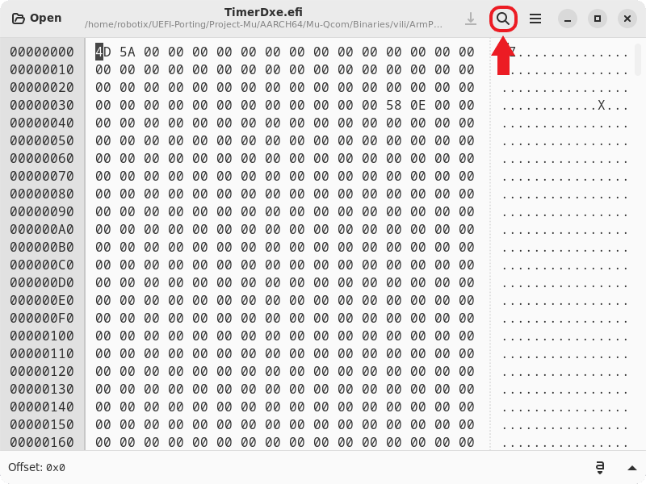
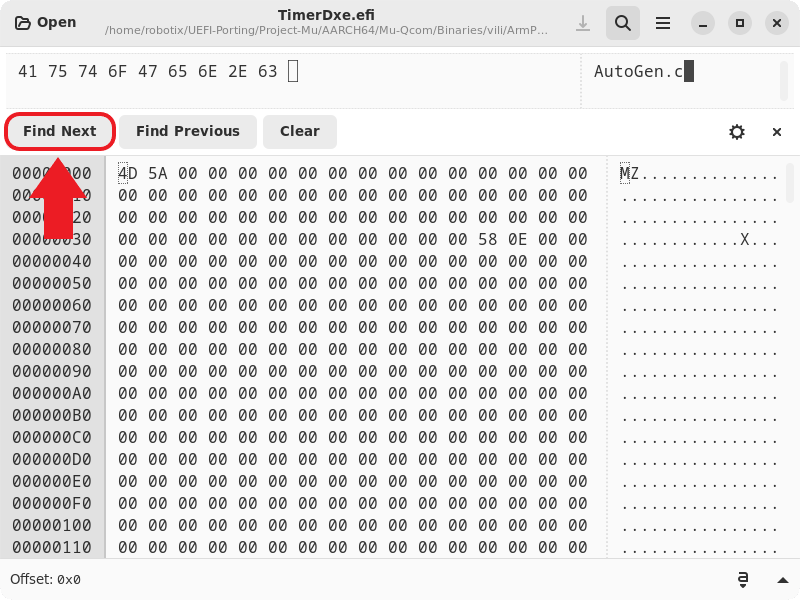
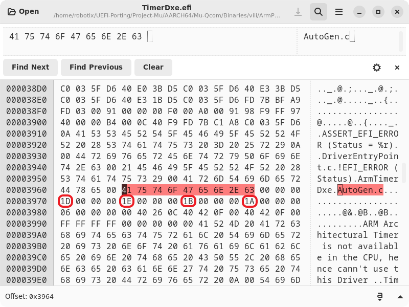

# Adding SoCs

## Before you Begin

Make sure that the SoC you are trying to add isn't already Supported. <br />
Otherwise Skip this entire Guide.

## Description

This Guide will show you how to make an UEFI Port for an Snapdragon SoC.

<table>
<tr><th>Table of Contents</th></th>
<tr><td>
  
- Adding SoCs
    - [Copying Files & Modify](#copying-files--modify-them-step-1)
        - [SoC Folder](#creating-soc-folder-step-11)
        - [.dsc.inc File](#modify-dsc.inc-file-step-12)
        - [Modify SMBios](#modify-smbios-step-13)
        - [Modify Librarys](#modify-librarys-step-14)

</td></tr> </table>

## Copying Files & Modify them (Step 1)

Struckture of Files for SoCs:
```
Mu-Silicium/Silicon/Qualcomm/<SoC Codename>Pkg/
├── AcpiTables
│   └── <ACPI Tables>
├── Drivers
│   └── SmBiosTableDxe
│       ├── DataDefinitions.h
│       ├── SmBiosTableDxe.c
│       └── SmBiosTableDxe.inf
├── Library
│   └── <Libraries>
└── <SoC Codename>.dsc.inc
```

## Creating SoC Folder (Step 1.1)

In `./Silicon/Qualcomm/` are all SoC Folders located. <br />
Copy any SoC Folder of your Chosse and Rename it to `<SoC Codename>Pkg`. <br />
NOTE: You might want to copy a SoC Folder that is similar to yours.

## Modify .dsc.inc File (Step 1.2)

In this File we need to change a lot. <br />
Lets begin with renaming the old SoC Name to your SoC Name.

After that we change the Timer & GIC Values to the right Values according to your SoC.

First, Open TimerDxe.efi from a Device's XBL with the same SoC in GHex. <br />
After that, Search `AutoGen.c` in TimerDxe.efi:




Once you Pressed `Find Next`, It will bring you to the Location where PCDs are Stored. <br />
The Timer Values are PCDs, So you will find then there, Here for wich is wich:



Convert these 4 Timer Interrupt Hex Values in Decimal Values and Put them in the .dsc.inc File. <br />
It should look like this after that:
```
# NOTE: This is just an Example!
gArmTokenSpaceGuid.PcdArmArchTimerSecIntrNum|29   # 0x1D
gArmTokenSpaceGuid.PcdArmArchTimerIntrNum|30      # 0x1E
gArmTokenSpaceGuid.PcdArmArchTimerVirtIntrNum|27  # 0x1B
gArmTokenSpaceGuid.PcdArmArchTimerHypIntrNum|26   # 0x1A
```

Now We will Update the GIC Values. <br />
`PcdGicDistributorBase` and `PcdGicRedistributorsBase` are the two Values of the `interrupt-controller` Node in the DTS. <br />
```
# NOTE: This is just an Example!
interrupt-controller@17a00000 {
  compatible = "arm,gic-v3";
  #interrupt-cells = <0x03>;
  interrupt-controller;
  #redistributor-regions = <0x01>;
  redistributor-stride = <0x00 0x20000>;
  reg = <0x17a00000 0x10000 0x17a60000 0x100000>;
             |                  |
         1st Value          2nd Value
  interrupts = <0x01 0x09 0x04>;
  phandle = <0x01>;
};
```
`PcdGicInterruptInterfaceBase` is same Value as `PcdGicRedistributorsBase`. <br />

Once the GIC Values are Correct, Update the ACPI PCD too. <br />
Set `PcdAcpiDefaultOemRevision` to your SoC Name Example: `SM8350 -> 0x00008350`

Now Update `PcdCoreCount`, `PcdClusterCount` and `PcdHasLevel3Cache` to the Correct Values. <br />
These Values should be in the Internet SoC Specs.

After that we need to change SmBios Values: <br />
from this:
```
gSiliciumPkgTokenSpaceGuid.PcdSmbiosProcessorModel|"Snapdragon (TM) 888 @ 2.84 GHz"
gSiliciumPkgTokenSpaceGuid.PcdSmbiosProcessorRetailModel|"SM8350"
```
to this:
```
gSiliciumPkgTokenSpaceGuid.PcdSmbiosProcessorModel|"Snapdragon (TM) <SoC Name> @ <SoC Speed> GHz"
gSiliciumPkgTokenSpaceGuid.PcdSmbiosProcessorRetailModel|"<SoC Codename>"
```

The SmBios Values should be correct now. <br />
Also set `PcdIsPowerOkImplemented` to the right Value. <br />
If you are not sure then set it to `FALSE`.

Now the last thing you need to do is Update the `USE_PHYSICAL_TIMER` Define at the Top. <br />
Change it to 0 If your SoC Uses a Virtual Timer, Otherwise Set it to 1. <br />
Like every Older SoC like SM8150 and below have a Physical Timer. <br />
The Newer ones like SM8250 should have a Virtual Timer.

## Modify SmBios (Step 1.3)

SmBios defines Device Infos from CPU and maybe also other Devices. <br />
Windows and Linux uses these Infos to display correct Values, <br />
Example: The CPU Name you see in Device Manager is defined in SmBios.

There are multiple Things you need to change: `SMBIOS_TABLE_TYPE4`, `SMBIOS_TABLE_TYPE7` and `SMBIOS_TABLE_TYPE17` <br />
First, Open `DataDefinitions.h` in `Silicon/Qualcomm/<SoC Codename>Pkg/Drivers/SmBiosTableDxe/`. <br />
Now we can begin with `SMBIOS_TABLE_TYPE4`:

It defines some CPU Values like Speed and Clusters. <br />
Here is a template Section:
```c
SMBIOS_TABLE_TYPE4 mProcessorInfoType4_<Cluster Name> = {
  {EFI_SMBIOS_TYPE_PROCESSOR_INFORMATION, sizeof(SMBIOS_TABLE_TYPE4), 0},
  1,                               // Socket String
  CentralProcessor,                // ProcessorType
  ProcessorFamilyIndicatorFamily2, // ProcessorFamily
  2,                               // ProcessorManufacture String
  {
   {
     0, // ProcessorSteppingId
     0, // ProcessorModel
     0, // ProcessorFamily
     0, // ProcessorType
     0, // ProcessorReserved1
     0, // ProcessorXModel
     0, // ProcessorXFamily
     0, // ProcessorReserved2
   },
   {
     0, // ProcessorFpu
     0, // ProcessorVme
     0, // ProcessorDe
     0, // ProcessorPse
     0, // ProcessorTsc
     0, // ProcessorMsr
     0, // ProcessorPae
     0, // ProcessorMce
     0, // ProcessorCx8
     0, // ProcessorApic
     0, // ProcessorReserved1
     0, // ProcessorSep
     0, // ProcessorMtrr
     0, // ProcessorPge
     0, // ProcessorMca
     0, // ProcessorCmov
     0, // ProcessorPat
     0, // ProcessorPse36
     0, // ProcessorPsn
     0, // ProcessorClfsh
     0, // ProcessorReserved2
     0, // ProcessorDs
     0, // ProcessorAcpi
     0, // ProcessorMmx
     0, // ProcessorFxsr
     0, // ProcessorSse
     0, // ProcessorSse2
     0, // ProcessorSs
     0, // ProcessorReserved3
     0, // ProcessorTm
     0, // ProcessorReserved4
    }
  },
  3, // ProcessorVersion String
  {
    0, // ProcessorVoltageCapability5V
    0, // ProcessorVoltageCapability3_3V
    0, // ProcessorVoltageCapability2_9V
    0, // ProcessorVoltageCapabilityReserved
    0, // ProcessorVoltageReserved
    0  // ProcessorVoltageIndicateLegacy
  },
  0,                     // ExternalClock
  <Cluster Speed in Mhz>, // MaxSpeed
  <Cluster Speed in Mhz>, // CurrentSpeed
  0x41,                  // Status
  ProcessorUpgradeOther, // ProcessorUpgrade
  0,                     // L1CacheHandle
  0,                     // L2CacheHandle
  0,                     // L3CacheHandle
  0,                     // SerialNumber
  0,                     // AssetTag
  4,                     // PartNumber
  <Number of Cluster Cores>, // CoreCount
  <Number of Cluster Cores>, // EnabledCoreCount
  <Number of Cluster Cores>, // ThreadCount
  0xAC,                  // ProcessorCharacteristics
  ProcessorFamilyARM,    // ARM Processor Family
};
```
Depending, How much Clusters you have, You need to add these to SmBios. <br />
For Example, Your SoC has 2 Clusters, Then you add two of these. <br />
Change `CoreCount`, `EnabledCoreCount` and `ThreadCount` to the amount of Cores the Cluster has. <br />
Then You need to Change `MaxSpeed` and `CurrentSpeed` to the Max Speed, The Cluster can. <br />
These two Values need to be in MHz Size.

After you modified these, we move on to `SMBIOS_TABLE_TYPE7`. <br />
Here is a template of Type 7:
```c
SMBIOS_TABLE_TYPE7 mCacheInfoType7_L1IC = {
  {EFI_SMBIOS_TYPE_CACHE_INFORMATION, sizeof(SMBIOS_TABLE_TYPE7), 0},
  1,      // SocketDesignation String
  0x0280, // Cache Configuration
  <Size of L1I>, // Maximum Size
  <Size of L1I>, // Install Size
  {
    0, // Other
    0, // Unknown
    0, // NonBurst
    0, // Burst
    0, // PiplelineBurst
    0, // Synchronous
    0, // Asynchronous
    0  // Reserved
  },
  {
    0, // Other
    0, // Unknown
    0, // NonBurst
    0, // Burst
    0, // PiplelineBurst
    0, // Synchronous
    0, // Asynchronous
    0  // Reserved
  },
  0,                      // Cache Speed unknown
  CacheErrorParity,       // Error Correction Multi
  CacheTypeInstruction,   // System Cache Type
  CacheAssociativity16Way // Associativity
};

SMBIOS_TABLE_TYPE7 mCacheInfoType7_L1DC = {
  {EFI_SMBIOS_TYPE_CACHE_INFORMATION, sizeof(SMBIOS_TABLE_TYPE7), 0},
  1,      // SocketDesignation String
  0x0280, // Cache Configuration
  <Size of L1D>, // Maximum Size
  <Size of L1D>, // Install Size
  {
    0, // Other
    0, // Unknown
    0, // NonBurst
    0, // Burst
    0, // PiplelineBurst
    0, // Synchronous
    0, // Asynchronous
    0  // Reserved
  },
  {
    0, // Other
    0, // Unknown
    0, // NonBurst
    0, // Burst
    0, // PiplelineBurst
    0, // Synchronous
    0, // Asynchronous
    0  // Reserved
  },
  0,                      // Cache Speed unknown
  CacheErrorParity,       // Error Correction Multi
  CacheTypeData,          // System Cache Type
  CacheAssociativity16Way // Associativity
};

SMBIOS_TABLE_TYPE7 mCacheInfoType7_L2C = {
  {EFI_SMBIOS_TYPE_CACHE_INFORMATION, sizeof(SMBIOS_TABLE_TYPE7), 0},
  1,      // SocketDesignation String
  0x0281, // Cache Configuration
  <Size of L2>, // Maximum Size
  <Size of L2>, // Install Size
  {
    0, // Other
    0, // Unknown
    0, // NonBurst
    0, // Burst
    0, // PiplelineBurst
    0, // Synchronous
    0, // Asynchronous
    0  // Reserved
  },
  {
    0, // Other
    0, // Unknown
    0, // NonBurst
    0, // Burst
    0, // PiplelineBurst
    0, // Synchronous
    0, // Asynchronous
    0  // Reserved
  },
  0,                     // Cache Speed unknown
  CacheErrorParity,      // Error Correction Multi
  CacheTypeUnified,      // System Cache Type
  CacheAssociativity8Way // Associativity
};

SMBIOS_TABLE_TYPE7 mCacheInfoType7_L3C = {
  {EFI_SMBIOS_TYPE_CACHE_INFORMATION, sizeof(SMBIOS_TABLE_TYPE7), 0},
  1,      // SocketDesignation String
  0x0282, // Cache Configuration
  <Size of L3>, // Maximum Size
  <Size of L3>, // Install Size
  {
    0, // Other
    0, // Unknown
    0, // NonBurst
    0, // Burst
    0, // PiplelineBurst
    0, // Synchronous
    0, // Asynchronous
    0  // Reserved
  },
  {
    0, // Other
    0, // Unknown
    0, // NonBurst
    0, // Burst
    0, // PiplelineBurst
    0, // Synchronous
    0, // Asynchronous
    0  // Reserved
  },
  0,                     // Cache Speed unknown
  CacheErrorParity,      // Error Correction Multi
  CacheTypeUnified,      // System Cache Type
  CacheAssociativity8Way // Associativity
};

CHAR8 *mCacheInfoType7_L1ICStrings[] = {
  "L1 Instruction Cache",
  NULL
};

CHAR8 *mCacheInfoType7_L1DCStrings[] = {
  "L1 Data Cache",
  NULL
};

CHAR8 *mCacheInfoType7_L2CStrings[] = {
  "L2 Cache",
  NULL
};

CHAR8 *mCacheInfoType7_L3CStrings[] = {
  "L3 Cache",
  NULL
};
```
You can get these Cache Sizes from a App in the Play Store called `CPU Info (open-source)`. <br />
If Your SoC dosen't have L3 for example then just remove it. <br />

After that We move to `SMBIOS_TABLE_TYPE17`. <br />
There you just need to change one Value: `Speed`, That should be in the Specs of your SoC. <br />
Then Moddify The Data Updates for `TYPE4`, `TYPE7` and `TYPE17` according to what you changed before in `SmBiosTableDxe.c`.

## Modify Librarys (Step 1.4)

Now we need to modify the Librarys, these are placed under `./Silicon/Qualcomm/<SoC Codename>Pkg/Library/`. <br />
In every Librarys `.inf` File rename the SoC Name to yours it should be enough for now.
